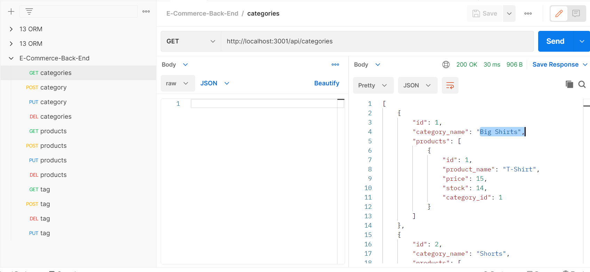

# E-Commerce-Back-End 
[Github](https://github.com/anhcu/E-Commerce-Back-End) <br>
[Video Demonstrating](https://www.youtube.com/watch?v=tbBll2XGJO4)<br>
[Video Postman](https://www.youtube.com/watch?v=UFtZ2xDtDag)

# Table of Contents
* [License](#License)
* [Description](#Description)
* [User_Story](#User_Story)
* [Criteria](#Criteria)
* [Installation](#Installation)
* [Usage](*Usage)
* [Contact](#Contact)
* [Mock](#Mock) 

# License
[](https://opensource.org/licenses/MIT)

# Description
This is a back end application where you can Create, Read, Update and Delete (CRUD) from your products, categories and tags data.
# User Story 
```md
AS A manager at an internet retail company
I WANT a back end for my e-commerce website that uses the latest technologies
SO THAT my company can compete with other e-commerce companies
```

# Criteria
```md
GIVEN a functional Express.js API
WHEN I add my database name, MySQL username, and MySQL password to an environment variable file
THEN I am able to connect to a database using Sequelize
WHEN I enter schema and seed commands
THEN a development database is created and is seeded with test data
WHEN I enter the command to invoke the application
THEN my server is started and the Sequelize models are synced to the MySQL database
WHEN I open API GET routes in Insomnia Core for categories, products, or tags
THEN the data for each of these routes is displayed in a formatted JSON
WHEN I test API POST, PUT, and DELETE routes in Insomnia Core
THEN I am able to successfully create, update, and delete data in my database
```
# Installation

Please install the following dependencies ... <br>
- [Dotenv](https://www.npmjs.com/package/dotenv)<br>
- [Express](https://www.npmjs.com/package/express)<br>
- [MySQL2](https://www.npmjs.com/package/mysql2)<br>
- [Sequelize](https://www.npmjs.com/package/sequelize)<br>


# Usage
1. Go to your terminal and run "npm run seed"
- - You are now pulling data from the seed file.<br>
2. After running "npm run seed", you'll run "npm start"
- - Now, you are calling for port 3001.<br>
3. Last, go to Postman to run GET, POST, PUT AND DELETE requests.

# Contact
  If you have any question or would like to reach out plase [email](mailto:anhcu714@gmail.com).
# Mock


